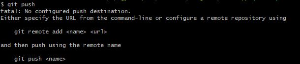

# GIT

## Git kliens telepítése és authentikációja

Git kliens letöltése: https://git-scm.com/downloads

Windowshoz: https://phoenixnap.com/kb/how-to-install-git-windows
(itt ügyeljünk rá, hogy a 7-es pontnál a `Windows explorer integration` legyen bejelölve)

Ahhoz, hogy az online tárolónkba pusholni tudjunk, a tárolónak azonosítania kell a csatlakozó klienst. Alapesetben a kliens a `git push` parancs kiadásakor mindig be fogja kérni a felhasználónevet és a jelszót, emiatt ajánlom [ezt](https://statistics.berkeley.edu/computing/faqs/git-auth) a cikket. SSH esetén ez a cikk csak Linuxon mutatja meg a kulcsgenerálást, így ha valaki ezt a megoldást választja, annak ajánlom [ezt](https://support.atlassian.com/bitbucket-cloud/docs/set-up-an-ssh-key/) is.


## repository létrehozása
Hozzunk létre egy új repository-t az online tárolónkban. Ide fogjuk `push`olni a változásokat.


Majd adjuk meg a repository nevét és tegyük publikussá.


## Projekt létrehozása és hozzáadása githez
Android studioban hozzunk létre egy új projektet, ezt szeretnénk majd feltölteni az online tárolóba. Ha a git telepítésekor bejelöltük a `Windows explorer integration` komponenst, akkor a projekt mappán belül egyszerűen meg tudunk nyitni egy git bash-t:


Jelenleg a projekt nem egy git repository (`git status` errort fog dobni). Ahhoz, hogy vezessük a változásokat, inicializálnunk kell a gitet projekt mappáján belül (`git init`). Ha ezt megtettük, a `git status` már jelzi is, hogy változások vannak a mappában, amik még nincsenek elmentve.


```
git add .
git commit -m "feat: add initial project"
git push
```

Még semmi kapcsolat nincs az online tárolónk, és az újonnan létrehozott local repositorynk között, ezért a `git push` hibára fut:


Le kell másolnunk az online tárolóban létrehozott repository címét, itt figyeljünk arra, hogy ha az authentikációnál az 1-es megoldást választottuk (`Using a personal authentication token or password`), akkor a menüből a HTTPS címet kell kimásolni, ha pedig az SSH alapú megoldást választottuk akkor... 


A kimásolt címet a git által fentebb ajánlott `git remote add <name> <url>` paranccsal tudjuk beállítani. A `<name>` helyére konvenció szerint az `origin` szó kerül:
```
git remote add origin repository_url
```


Ha most megpróbálunk `push`olni, akkor már nem az eddigi hibát kapjuk:


Ez azért van, mert a lokálisan létrehozott `master` branchnek még nem mondtuk meg, hogy melyik remote tartozik hozzá (egy local git repohoz tartozhat több remote is, és branchenként kell megmondani, hogy rá melyik az érvényes).
```
git push --set-upstream origin master
```
`--set-upstream` -> beállítjuk, hogy a push parancs melyik remotera töltse fel a megadott branchhez tartozó változásokat. konvenció szerint a remote neve `origin` (ezt korábban állítottuk be), a branch neve pedig annak a branchnek a neve, amit szeretnénk feltölteni, esetemben `master`.


A `--set-upstream` kapcsoló helyettesíthető a `-u` kapcsolóval is:
```
git push -u origin master
```


## Projekt vezetése gitben

Most, hogy már van egy initial commitunk, és működik a feltöltés is, dolgozhatunk a projektünkön. Mivel órán bemutattam ezt, így itt nem vezetném végig az egészet képekkel, csak a parancsokat mellékelem némi magyarázattal.


### layout kialakítása
Adjunk hozzá egy TextView-t, egy EditText-et és egy Button-t. 
A Button megnyomására jelenjen meg az EditTextbe írt felirat a TextView-n.
```sh
git add .
git commit -m "feat: add basic behaviour"
git push
```
Nem kötelező mindig pusholni, elég a legvégén egyszer. Az időpont, ami megjelenik Githubon, nem a `push` kiadásához tartozik, hanem a commitokhoz.

### Telefon elforgatása
Ha elforgatjuk a telefont, látszik, hogy a TextView visszaáll alaphelyzetbe, elveszítjük a hozzáadott módosításokat. Ezt állapotmentéssel tudjuk elkerülni. az [onSaveInstanceState](https://developer.android.com/guide/components/activities/activity-lifecycle#save-simple,-lightweight-ui-state-using-onsaveinstancestate) metódus mindig elkapja az ilyen változásokat, ezért felül kell őt írnunk, majd induláskor betölteni az adatokat, amennyiben léteznek.

```kotlin
 [onCreate metódusban:] {
         if(savedInstanceState != null){
            textView.text = savedInstanceState.getString(TEXT_VIEW_KEY)
        }
    }

    override fun onSaveInstanceState(outState: Bundle) {
        super.onSaveInstanceState(outState)
        outState.putString(TEXT_VIEW_KEY, textView.text.toString())
    }
```

```sh
git add .
git commit -m "feat: add basic instance state save"
```


### Perzisztencia

Az alkalmazás kilépéskor így is elveszít minden adatot, most ezt fogjuk megoldani, mégpedig a [SharedPreferences](https://developer.android.com/reference/android/content/SharedPreferences) alkalmazásával 

Mező felvétele az osztályban:
```kotlin
lateinit var sharedPreference: SharedPreferences
```

SharedPreference lekérdezése a rendszertől:
```kotlin
sharedPreference = getSharedPreferences(getString(R.string.preference), Context.MODE_PRIVATE)
```
`getString(R.string.preference)` -> resourcesben felvettem egy mezőt (`res/values/strings`):
```xml
<string name="preference">com.example.persistence.SHARED_PREFERENCE_KEY</string>
```

Az adatok mentését az [onPause](https://developer.android.com/guide/components/activities/activity-lifecycle) életciklus metódusban végzem el egy Scope function alkalmazásával ([with](https://kotlinlang.org/docs/scope-functions.html#with)):
```kotlin
    override fun onPause() {
        super.onPause()
        with (sharedPreference.edit()) {
            putString(TEXT_VIEW_KEY, textView.text.toString())
            apply()
        }
    }
```


```kotlin
[onCreate]:{
    val result = sharedPreference.getString(TEXT_VIEW_KEY,"null")
    if(result != "null"){
        textView.text = result
    }
}

[class]:{
    companion object {
        private const val TEXT_VIEW_KEY = "TEXT_VIEW_KEY"
    }
}
```

Így már nem vesznek el az adatok bezáráskor sem.
```
git add .
git commit -m feat: add persistent state save"
git push
```


## Kiegészítés

[Conventional commits](https://www.conventionalcommits.org/en/v1.0.0/)

[Companion objects](https://kotlinlang.org/docs/object-declarations.html#semantic-difference-between-object-expressions-and-declarations)
