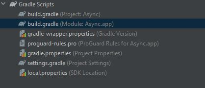
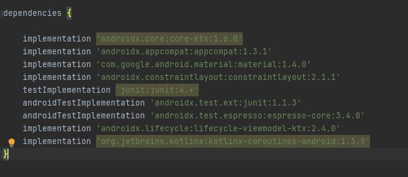
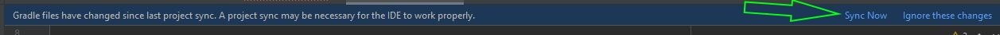
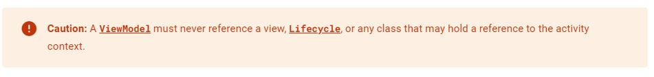

# Datepicker

Szükséges osztályok:
 - [Calendar](https://developer.android.com/reference/kotlin/android/icu/util/Calendar) (a jelenlegi idő megállapításához)
 - [DatePickerDialog](https://developer.android.com/reference/android/app/DatePickerDialog)
 
 Valamint implementálni a `DatePickerDialog.OnDateSetListener`-t


# Async
 - [Kotlin coroutines](https://kotlinlang.org/docs/coroutines-overview.html)
 - [Kotlin coroutines on Android](https://developer.android.com/kotlin/coroutines)
 - [Android ViewModel](https://developer.android.com/topic/libraries/architecture/viewmodel)
 - [LiveData](https://developer.android.com/topic/libraries/architecture/livedata#kotlin)
 - [Observer](https://developer.android.com/reference/java/util/Observer)

## Gradle beállítása
Hozzá kell adnunk a projektünkhöz a coroutines-t és a ViewModelt is. Ehhez nyissuk meg a Module-hoz tartozó build.gradle fájlt:


Keressük meg a dependency-k elérését:
 - [ViewModel](https://developer.android.com/jetpack/androidx/releases/lifecycle#groovy)
 - [Coroutines](https://developer.android.com/kotlin/coroutines#dependency)

Adjuk hozzá őket:



Majd kattintsunk a `Sync Now` gombra a jobb felső sarokban:



## Osztályok létrehozása
Hozzunk létre egy classt, ami a ViewModelből van örökölve, majd adjunk hozzá egy publikus metódust, ami elindítja az async taszkunkat, valamint egy suspendable metódust is, ami a feladatot kirakja egy másik threadre:

```kotlin
class AsyncTaskRunner(val progressBar: ProgressBar): ViewModel() {

    // Sync method
    fun runAnAsyncTask(iterations: Int) {

        viewModelScope.launch {
            println("start load")
            doTask(iterations)
            println("end load")
        }
    }

    // Async method
    private suspend fun doTask(iterations: Int) {
        return withContext(Dispatchers.IO){
            var current  = 0
            repeat(iterations) {
                current += 1
                delay(100)
                progressBar.progress = current
            }
        }
    }
}
```

Futtatás a Main classból (hozzá kell adni egy ProgressBar-t a layouthoz, és ezt le is kell kérdezni létrehozáskor a `findViewById` metódussal):
```kotlin
    fun buttonHandler(view: View){
        val runner = AsyncTaskRunner(progressBar)
        runner.runAnAsyncTask(500)
    }
```

## LiveData
Az előző megoldással az a probléma, hogy bizonyos UI eszközöket hiába adunk át az `AsyncTaskRunner`nek, az Android tiltja, hogy a UI threaden kívül más is módosítsa azokat, így például egy `TextView`-t átadva az alkalmazás hibára fut a gomb megnyomásakor. Ezen kívül a [dokumentáció](https://developer.android.com/topic/libraries/architecture/viewmodel#implement) is jelzi:



Ennek a megoldására a [LiveData](https://developer.android.com/topic/libraries/architecture/livedata#kotlin) classt hívjuk segítségül. Az ő segítségével tudunk létrehozni olyan objektumokat, amelyek változás esetén jeleznek nekünk. Egész pontosan az fog történni, hogy az `AsyncTaskRunner`-ben biztosítunk egy privát `LiveData` mezőt arra a típusra, amit használni szeretnénk (generikus osztály, most `String` lesz), valamint figyelünk az inicializálására is (`AsyncTaskRunner` konstruktorában létrehozzuk), és biztosítunk egy `get`tert, hogy hozzáférjünk majd kívülről.

```kotlin
[AsyncTaskRunner]

    private val dataToShow: MutableLiveData<String>

    init {
        dataToShow = MutableLiveData()
    }

    fun getData(): LiveData<String>{
        return dataToShow
    }
```

Vagy shorthand:
```kotlin
    private val dataToShow = MutableLiveData<String>()
    
    fun getData(): LiveData<String>{
        return dataToShow
    }
```

A `doTask` metódusban pedig beállítjuk az értékét a mezőnek, ezt viszont nem értékadó operátorral tesszük (`=`), hanem a `LiveData` objektumokon levő `postValue` metódussal:

```kotlin
repeat(iterations) {
    current += 1
    delay(100)
    dataToShow.postValue(current.toString())
}
```

A `MainActivity`ben már csak példányosítanunk kell az `AsyncTaskRunner`t, majd lekérdezni a `LiveData` példányt és feliratkozni a változásaira az `observe` metóduson keresztül:

```kotlin
val runner = AsyncTaskRunner()

runner.getData().observe(this, Observer {
    textView.text = it
})

runner.runAnAsyncTask(50)
```

Az `observe` metódus első paramétere az a példány, ahonnan meg akarjuk figyelni a `LiveData`-t, a második paramétere pedig az [Observer](https://developer.android.com/reference/java/util/Observer) interfész egy implementációja. Ha Android Studioban nézzük a kódot, látni, hogy az `it` valójában az a paraméter, amit a `postValue` metódusnak átadunk.

Vegyük észre, hogy ebben az esetben nem az `AsyncTaskRunner` osztály teszi ki a változásokat a `View`-ra, ő csupán ad nekünk egy objektumot, aminek a `MainActivity`ben meg tudjuk figyelni a változásait, és reagálni tudunk rá a UI threaden.

# Kiegészítés
[LiveData Explained](https://www.youtube.com/watch?v=suC0OM5gGAA&ab_channel=Stevdza-San)